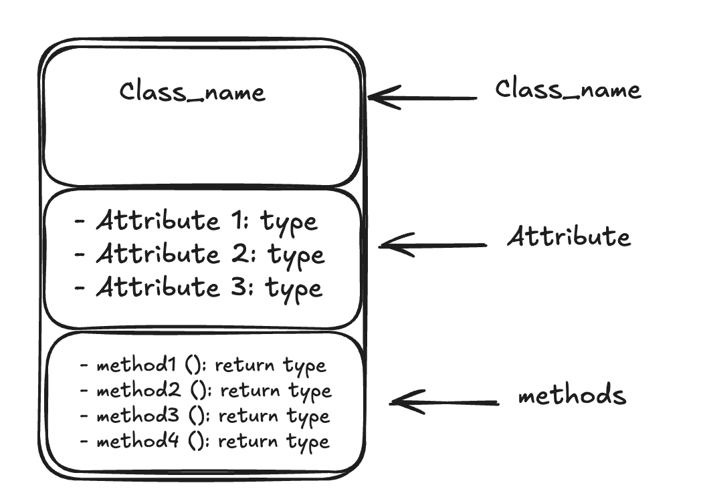
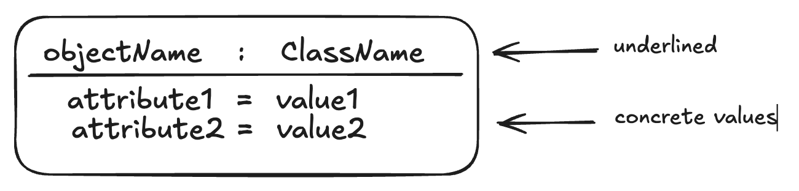

# UML Class Diagrams & Object Diagrams 

## Table of Contents

1. [Introduction](#introduction)
2. [Part I — UML Class Diagrams](#part-i--uml-class-diagrams)
   - [What is a Class Diagram?](#what-is-a-class-diagram)
   - [Class Notation](#class-notation)
   - [Visibility Modifiers](#visibility-modifiers)
   - [Parameter Directionality](#parameter-directionality)
   - [Relationships Between Classes](#relationships-between-classes)
   - [Purpose of Class Diagrams](#purpose-of-class-diagrams)
   - [Benefits of Class Diagrams](#benefits-of-class-diagrams)
3. [Part II — UML Object Diagrams](#part-ii--uml-object-diagrams)
   - [What is an Object Diagram?](#what-is-an-object-diagram)
   - [Key Concepts: Object and Classifier](#key-concepts-object-and-classifier)
   - [Object Diagram Notations](#object-diagram-notations)
   - [Purpose of Object Diagrams](#purpose-of-object-diagrams)
   - [Benefits of Object Diagrams](#benefits-of-object-diagrams)
   - [How to Draw an Object Diagram](#how-to-draw-an-object-diagram)
   - [Use Cases of Object Diagrams](#use-cases-of-object-diagrams)
4. [Class Diagram vs Object Diagram — Key Differences](#class-diagram-vs-object-diagram--key-differences)
5. [My Recommendations from the Field](#my-recommendations-from-the-field)
6. [References](#references)

---

## Introduction

When I design systems — whether a microservice mesh, a monolithic backend, or a domain model for a complex business — I start with UML. Of the 14 diagram types UML offers, two form the bedrock of **structural modeling**: the **Class Diagram** and the **Object Diagram**.

- The **Class Diagram** gives me a timeless blueprint — the template of how entities are shaped and how they relate.
- The **Object Diagram** gives me a snapshot — a freeze-frame of the system's state at a specific moment in time, with real instances and real values.

Understanding both, and knowing when to use each, is something I consider a non-negotiable skill for any engineer serious about Low Level Design (LLD).

---

## Part I — UML Class Diagrams

### What is a Class Diagram?

A UML Class Diagram shows the **static structure** of a system by displaying its classes, their attributes, methods, and the relationships between them. I use it to communicate how the system is organized and how its components are designed to interact.

In my experience, the class diagram is the single most important diagram I draw before writing any code. It forces me to think through:
- What entities exist in the system?
- What data does each entity hold?
- What behavior does each entity expose?
- How do entities relate to one another?

---

### Class Notation

A class is represented as a **rectangle divided into three compartments**:

| Compartment | Purpose |
|---|---|
| **Class Name** | The identity of the class — centered, bold, at the top |
| **Attributes** | Data members of the class — their types and visibility |
| **Methods** | The operations/behaviors the class exposes |

---

### Visibility Modifiers

Every attribute and method in a class diagram is prefixed with a visibility symbol. These four symbols are something I enforce as a standard in every class diagram I review:

| Symbol | Access Level | Meaning |
|---|---|---|
| `+` | **Public** | Accessible by all classes |
| `-` | **Private** | Accessible only within the class itself |
| `#` | **Protected** | Accessible by the class and its subclasses |
| `~` | **Package/Default** | Accessible by classes within the same package |

> **My rule of thumb:** Default to `private` for attributes and `public` only for methods that form a deliberate API contract. Everything else is implementation detail.

---

### Parameter Directionality

When I document methods in class diagrams, I find it valuable to annotate parameter directionality — it makes the data flow crystal clear, especially in service-layer designs.
<!-- 
 -->

| Notation | Meaning |
|---|---|
| `in` | Parameter is passed **into** the method (input only) |
| `out` | Parameter is passed **back** from the method (output only) |
| `inout` | Parameter is both sent to and returned from the method |

---

### Relationships Between Classes

This is where class diagrams really earn their keep. There are eight relationship types I regularly use:

#### 1. Association
A **bi-directional relationship** between two classes. Instances of one class are connected to instances of another. Represented by a solid line.

#### 2. Directed Association
Similar to association, but with **a clear direction** — one class is associated with the other in a specific navigable way. Represented by a solid line with an arrowhead.

#### 3. Aggregation
A **"whole-part" (has-a) relationship** where the child can exist independently of the parent. Represented by a hollow diamond on the parent side.

> Example: A `Department` aggregates `Employee` objects. Employees can exist without the Department.

#### 4. Composition
A **stronger form of aggregation** — the child cannot exist without the parent. Represented by a filled diamond on the parent side.

> Example: A `House` is composed of `Rooms`. Rooms cannot exist without the House.

#### 5. Generalization (Inheritance)
An **"is-a" relationship** where a subclass inherits attributes and behaviors from a superclass. Represented by a solid line with a hollow arrowhead pointing to the parent.

#### 6. Realization (Interface Implementation)
Indicates that a class **implements the contract** defined by an interface. Represented by a dashed line with a hollow arrowhead.

#### 7. Dependency
A **loose coupling** where one class relies on another but doesn't own or extend it. Any change in the supplier may affect the client. Represented by a dashed arrow.

#### 8. Usage (Dependency) Relationship
A specific type of dependency where the **client class utilizes the supplier class** to perform certain tasks or access functionality. The client relies on the services the supplier provides but does not own it.

---

### Purpose of Class Diagrams

From my experience, here is why class diagrams matter:

- They are the **only UML diagram type** that can comprehensively represent the full spectrum of OOP concepts — encapsulation, inheritance, polymorphism, abstraction.
- They significantly **speed up design and analysis** when done upfront before coding begins.
- They serve as the **foundation for component and deployment diagrams** in HLD.
- They enable both **forward engineering** (diagram → code) and **reverse engineering** (code → diagram), making them invaluable for legacy system documentation.

---

### Benefits of Class Diagrams

- Provide a clear architectural view of classes, their state, and their behavior.
- Communicate relationships between components to both technical and non-technical stakeholders.
- Act as a development guide that keeps implementation consistent with design intent.
- Enable automated code generation in many UML toolchains, reducing manual errors.

---

## Part II — UML Object Diagrams

### What is an Object Diagram?

I think of an Object Diagram as a **screenshot of a running system**. While a class diagram gives me the blueprint, an object diagram shows me what the system actually looks like at a specific instant during execution — with real instances and real values assigned to attributes.

Formally, an object diagram in UML shows a complete or partial view of the structure of a modeled system **at a specific point in time**, displaying instances of classes and their relationships.

Since object diagrams capture the system in a concrete instantiated state, I use them frequently when I need to validate that my class design holds up under realistic data scenarios.

---

### Key Concepts: Object and Classifier

**Object:** A specific instance of a class. While a class is the abstract blueprint, an object is the concrete, individual occurrence of that class — it carries unique values for its attributes.

**Classifier:** In UML, a classifier is a grouping of elements that share common features like attributes, methods, and operations. Think of it as an abstract metaclass that defines the boundary for a group of instances sharing common static and dynamic features. Classes, components, and deployment nodes are all classifiers in UML. I create object diagrams by **instantiating** these classifiers.

---

### Object Diagram Notations

#### 1. Objects (Instance Specifications)

An object is represented as a **rectangle**, similar to a class box, but with a key syntactic difference — the object name is underlined and formatted as `objectName : ClassName`.

When I need to represent how an object's state changes over time, I create **multiple instance specifications** of the same class with different attribute values.

#### 2. Attributes and Values

Unlike class diagrams where I list attribute types, in object diagrams I list **actual assigned values** — this is what makes them useful for scenario modeling.

#### 3. Link

A **link** is the object-level equivalent of an association. It represents a relationship between two specific object instances and is drawn as a solid line connecting the two object boxes.

#### 4. Dependency Relationships

A **dependency** in an object diagram is a unidirectional relationship showing that one object relies on another. Any change in the independent object may cascade to the dependent one. Drawn as a dashed arrow.

Dependency subtypes include: Abstraction, Binding, Realization, Substitution, and Usage.

#### 5. Association

An **association link** connects two objects when one references members of the other. It can be uni-directional or bi-directional. Drawn as an arrow line.

#### 6. Aggregation

Represents a **"has-a" relationship** between object instances where the contained object can survive independently. Uses a hollow diamond on the container side.

> Example: A library aggregates books — books can exist without the library.

#### 7. Composition

Represents a **strong ownership** between objects where the child cannot exist without the parent. Uses a filled diamond on the container side.

> Example: A Person is composed of Arms — Arms cannot exist independently.

---

### Purpose of Object Diagrams

- They provide a **detailed view of how objects interact** in specific runtime scenarios, which no other diagram type can replicate at this level of specificity.
- They accelerate design analysis by testing whether a class model holds up with real instance data.
- They are especially useful **during the implementation phase** of software development.
- They promote a **shared understanding** of specific object states and relationships among team members.

---

### Benefits of Object Diagrams

| Benefit | How I Use It |
|---|---|
| **Detailed Relationship Insight** | I use object diagrams to trace specific object interactions and dependencies at runtime |
| **Implementation Guidance** | They help me show developers exactly how to instantiate and wire objects together in code |
| **Integration Testing Assistance** | I use them to design integration test scenarios based on real object collaboration |
| **Validation of Code** | I compare object diagrams against actual code to ensure the implementation aligns with design intent |
| **Scenario Illustration** | I document edge-case scenarios using object diagrams to communicate them clearly to QA and stakeholders |

---

### How to Draw an Object Diagram

Here is my step-by-step process:

1. **Identify the scenario** — Pick a specific runtime state or use case you want to model.
2. **Identify relevant classes** — Determine which classes participate in this scenario.
3. **Create object instances** — Draw rectangles for each object instance. Name them using `objectName : ClassName` notation (underlined).
4. **Populate attribute values** — Fill in the concrete data values for each object. This is the key step — real values, not types.
5. **Draw relationships** — Connect objects with links, associations, aggregations, or compositions as appropriate.
6. **Label relationships** — Add role names and multiplicity labels where relevant to improve readability.
7. **Review and refine** — Validate that the diagram accurately reflects the intended system state. Cross-check against the class diagram.
8. **Use digital tools** — I prefer tools like PlantUML, Lucidchart, or draw.io for maintainable, version-controlled diagrams.

---

### Use Cases of Object Diagrams

| Use Case | Description |
|---|---|
| **System Implementation** | Guides developers when instantiating real objects and wiring them together |
| **Communication and Collaboration** | Bridges the gap between design and implementation when discussing specific runtime states |
| **Test Case Design** | Allows testers to design test cases grounded in real object states and interactions |
| **Debugging and Troubleshooting** | Helps in understanding the state of specific objects at a point in time during bug investigation |
| **Training and Documentation** | Helps new team members understand concrete system behavior rather than abstract blueprints |

---

## Class Diagram vs Object Diagram — Key Differences

| Dimension | Class Diagram | Object Diagram |
|---|---|---|
| **What it shows** | Blueprints / templates of entities | Concrete instances of those entities |
| **Represents** | Classes, attributes (types), methods | Objects, attributes (values), links |
| **Time scope** | Timeless / static structure | A specific snapshot in time |
| **Level of abstraction** | Abstract | Concrete |
| **Used for** | System architecture, design planning | Scenario validation, debugging, testing |
| **Contains methods?** | Yes | No |
| **Notation for names** | Plain class name | `objectName : ClassName` (underlined) |
| **Relationship term** | Association | Link |
| **When I use it** | Before writing code | To validate design with real data |

---

## My Recommendations from the Field

After 10 years of designing systems, here is my practical advice on using these two diagram types:

**1. Always draw the class diagram first.** It forces you to model your domain properly before thinking about instances. Skipping it leads to class soup — bloated, poorly structured code that's a nightmare to maintain.

**2. Use object diagrams to stress-test your class design.** I routinely take a class diagram and try to instantiate it with real-world data. If creating valid object diagrams feels awkward or impossible, it's a strong signal that the class design needs revisiting.

**3. Keep diagrams in sync with code.** I've seen too many projects where diagrams become misleading documentation artifacts. Pick a tool that supports round-trip engineering or integrate diagram generation into your CI pipeline.

**4. Use visibility modifiers deliberately.** Don't default everything to `public`. Class diagrams are a great forcing function to think about encapsulation boundaries.

**5. Know your relationship types cold.** The difference between aggregation and composition, or between dependency and association, has real implications in code — particularly around object lifecycle management and memory. Get it right on paper before it costs you in production.

**6. Object diagrams shine in code reviews.** When reviewing a complex instantiation or initialization sequence, sketching a quick object diagram on a whiteboard saves 30 minutes of verbal back-and-forth.

---

## References

- [UML Class Diagrams — GeeksforGeeks](https://www.geeksforgeeks.org/system-design/unified-modeling-language-uml-class-diagrams/)
- [UML Object Diagrams — GeeksforGeeks](https://www.geeksforgeeks.org/system-design/unified-modeling-language-uml-object-diagrams/)
- [UML Diagrams Overview — GeeksforGeeks](https://www.geeksforgeeks.org/system-design/unified-modeling-language-uml-introduction/)
- [Low Level Design (LLD) — GeeksforGeeks](https://www.geeksforgeeks.org/system-design/what-is-low-level-design-or-lld-learn-system-design/)

---
